# Installation and configuration guide for Thingworx monitoring

## Background

`tsample` is small, customized tool which plays similar role to `telegraf`. Its focus is on gethering Thingworx performance metrics. Historically, this tool also supports collecting OS level performance metrics but it's highly recommended to collect OS level performance metrics by using `telegraf`.


## Recommanded deployment architecture

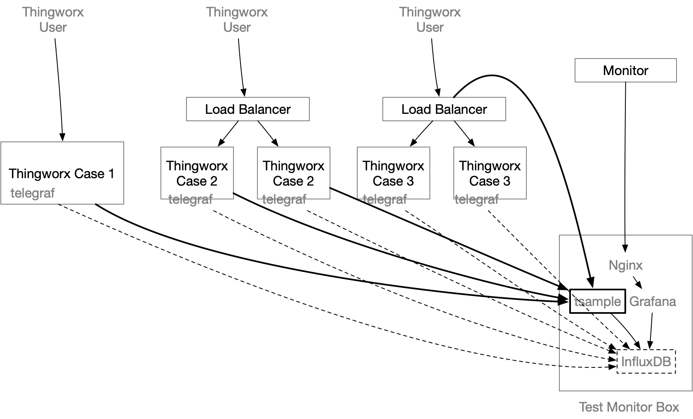

`tsample` can be deployed in the same box where Thingworx tomcat is running, but it's recommended to deploy it on a seperated box to minimize any performance impact caused by the collector.

`tsample` supports export to `InfluxDB` and/or local file. In this document, it is assumed that `InfluxDB` will be used for monitoring purpose. Please note that this is not the same instance of InfluxDB being used by Thingworx (if configured).

### Supported Platform

`tsample` supports and has been tested on `windows 2016`, `MacOS 10.15`, `Ubuntu 16.04` and `Redhat 7.x`. It's anticipated to work on more general Ubuntu/Redhat/Mac/Windows release.

In case you need a build to run on Resperry PI, please let me know.

### Notice

This tool was built before the author knows `telegraf` and therefore it includes the capability to collect basic OS level performance metrics such as CPU usage, Memory usage and Disk usage. However, it's strongly recommended to use `telegraf` to do so.

this document will focus on explaining how to use it to collect Thingworx metrics.

## Configuration File

### Where to store configuration file

`tsample` will pickup configuration file in following sequence:

- from command line

  ```bash
  ./tsample -c <path to configuration file>
  ```

  

- from environment

  Linux:

  ```bash
  export TSAMPLE_CONFIG=<path to configuration file>
  ./tsample
  ```
  
  Windows:
  
  ```bat
  set TSAMPLE_CONFIG=<path configuration file>
  tsample.exe
  ```
  
  

- from default location

  `tsample` will try to find a file with name `config.toml` from same folder in which it starts.

### How to craft a configuration file

You can use following command to generate a sample file:

```bash
./tsample -c config.toml -e
```

or:

```bash
./tsample -c config.toml --export
```

A file with name `config.toml` will be generated with configuration sample. You can then adjust its content with following guide.


### Configuration file content

#### Format

Configuration file must be in `toml` format

#### `title` and `owner` section

Both sections are optional. The intention of these two sections is support doc tool in future.

#### `TestMachine` section

This is sectin is required and it defines where this tool will run. 

| Name                         | Note                                                         |
| ---------------------------- | ------------------------------------------------------------ |
| testid                       | Indicates the machine where this tool is running.            |
| sampling_cycle_inseconds     | Indicates the interval time of performance metrics sampling – typically 30, 20 or 10 seconds. Default value is 30 seconds, if not included. Values less than 10 seconds or greater than 60 seconds are not recommended. |
| sampling_timeout_inseconds   | Indicates the timeout for RESTful calls to ThingWorx. Default value is 10 seconds if not included. It's recommended to set this value between 10 and `sampling_cycle_inseconds`. |
| testmachine.onetime_sampling | (Optional) Recommend leaving it at default.                  |
| testmachine.repeat_sampling  | (Optional) and you can just change each metric to `false`; Recommend using telegraf to get OS level metrics. This feature will be removed in the next release, only remaining in the current release for code stability purposes. |


#### `thingworx_servers` section

This section is where you define targeted thingworx applications. Multiple Thingworx servers can be defined with same or different metrics to be collected.

| Name          | Note                                                         |
| ------------- | ------------------------------------------------------------ |
| alias         | It’s optional, but strongly recommended, that you give it a meaningful name. It would be a tag value in InfluxDB. A meaningful value will help you to define the performance dashboard more easily. |
| host and port | Indicates where ThingWorx server is running. In case `alias` is missed, then a combination of host and port will be used to distinguish the metrics result in InfluxDB as a tag value. |
| protocol      | Choice of `https` and `http`. It should be the protocol used by the targeted ThingWorx application |
| application   | Should always be `Thingworx` – changing this is not supported |
| app-key       | A valid `appKey` in ThingWorx, the associated user should have enough permission to access the performance metrics. |


##### `thingworx_servers.metrics` sections

Underneath each `thingworx_servers` section, there would be many metrics. In default example, following metics have been included:

- ValueStreamProcessingSubsystem
- DataTableProcessingSubsystem
- EventProcessingSubsystem
- PlatformSubsystem
- StreamProcessingSubsystem
- WSCommunicationsSubsystem
- WSExecutionProcessingSubsystem
- TunnelSubsystem
- AlertProcessingSubsystem
- FederationSubsystem

You can add your customized metrics, as long as the result follows same data shape. The default data shape has 3 columns:

| Column Name | Note                                                         |
| ----------- | ------------------------------------------------------------ |
| name        | STRING type                                                  |
| description | STRING type                                                  |
| value       | INTEGER or LONG, but this tool can accept `NUMBER` (64bit float) as well. |

If the output Data Shape exceeds above limitation, the tool will likely not work properly.

| Name                | Note                                                         |
| ------------------- | ------------------------------------------------------------ |
| url                 | Required - end point of RESTful API for each performance metric |
| split_desc_asprefix | Required - set to true                                       |
| name                | The measurement name in InfluxDB(or file name if result is exported to local file). |
| enabled             | Required - set to `true` or `false`. Use to easily control which metrics will be collected with minimal configuration changes |
| options             | Optional - Control which metrics are collected from this subsystem, instread of all. Example: `["totalWritesQueued", "totalWritesPerformed","queueSize"]` |
|                     |                                                              |


### `result_export_to_db` section

This section defines target `InfluxDB` as a sink of collected performance metrics.

| Name        | Note                                                         |
| ----------- | ------------------------------------------------------------ |
| using_udp   | Deprecated - please keep set to false. Will be removed in next release as udp will not be supported going forward |
| server_name | Name (or IP Address) of InfluxDB.                            |
| port        | Port for InfluxDB to communicate in HTTP protocol. It's typically 8086 |
| database    | Where your collected metrics will be stored.                 |
| enabled     | Set to `true` if you want to use InfluxDB as the storage. Otherwise, it should be `false`. |


### `result_export_to_file` section

This section defines target file storage for collected performance metrics.

| Name               | Note                                                         |
| ------------------ | ------------------------------------------------------------ |
| folder_name        | Desired location for performance metrics file to be stored.  |
| auto_create_folder | If the folder does not exist, then it will be automatically created if this is set to true |
| enabled            | Set to `true` if you want to use a local  file for storage. Otherwise set to `false`. |


## Grafana configuration example

### Monitor Value Stream

#### Step 1, Connect your grafana to InfluxDB

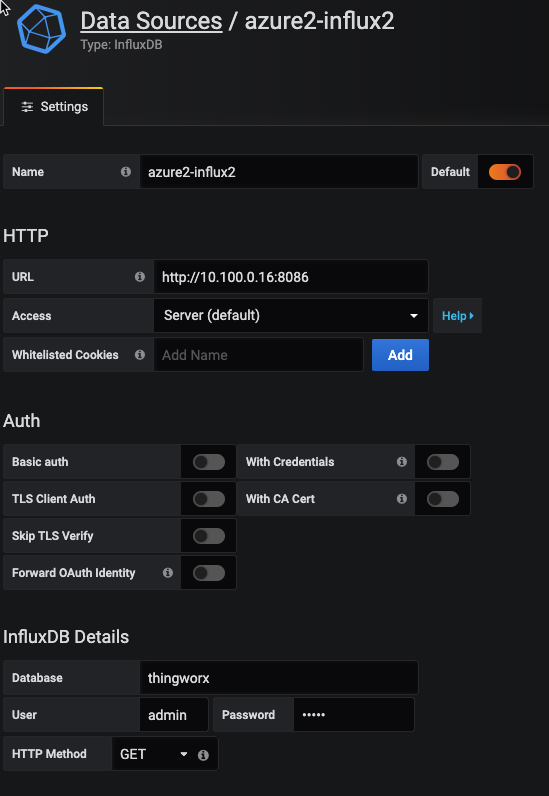

#### Step 2, create a new dashboard and then new query

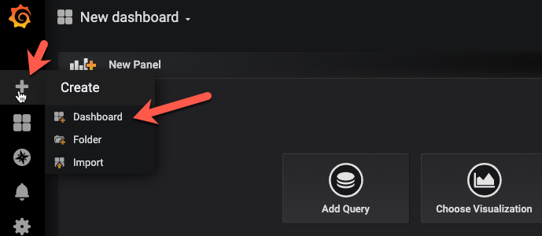

#### Step 3, A new query

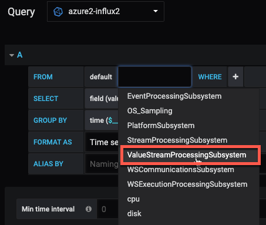


Depending on which metrics you defined to collect in the `tsample` configuration file, you would see a different choice of measurement in Grafana. Here, we will use `ValueStreamProcessingSubsystem` as an example.

#### Step 4, Choose right platform and provider


Some metrics is depending on database storage provider, like: value stream and stream. 

#### Step 5, Choose metrics figures

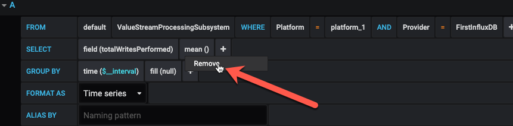

select "remove" to get rid of the default 'mean' calculation.


select `non_negative_difference` from `Transformations`. Using this transformation, Grafana can show us the speed of writes.

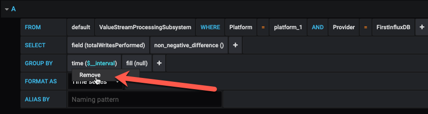

then, remove the default GROUP BY `time` clause.

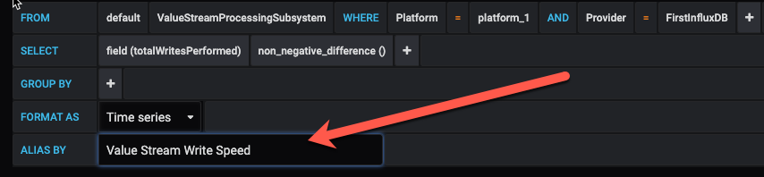

Assign a meaningful alias of this query

#### Step 6, Add another query

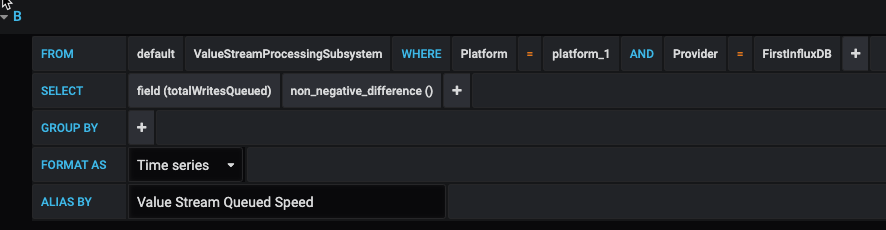

You can add another query as 'Value Stream Queued Speed' by following exactly same steps.

#### Step 7, Assign Panel Title

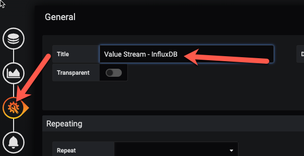

#### Step 8, Review Result


Let's go back to dashboard page and select 'last 15 minutes' or 'last 5 minutes' from top right coner. It should show a result similar to the chart below.

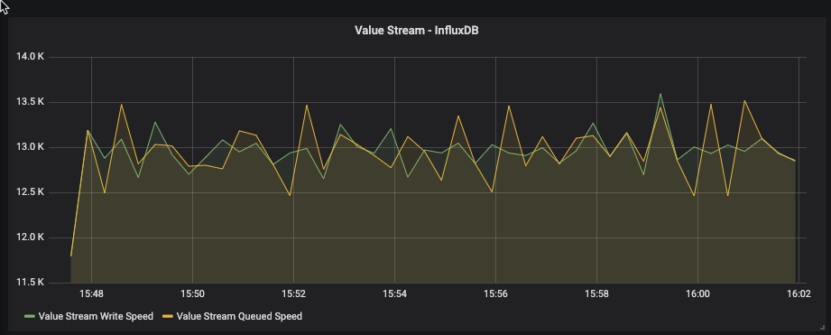


#### Step 9, Save dashboard

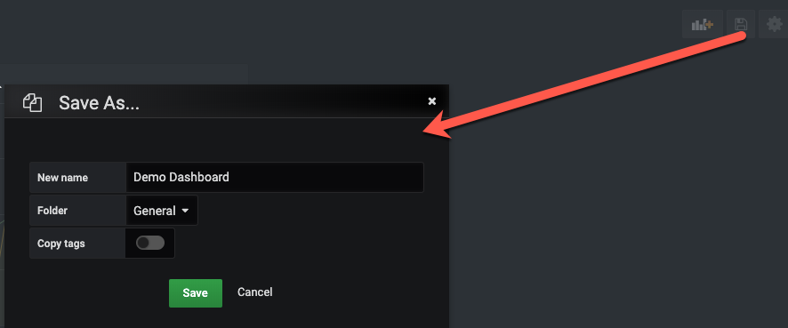

Don't forget to save your Dashboard before we add more panels.

#### Step 10, Refine the panel

It's difficult to figure out the high-level write speed from above panel and let's enhance it.

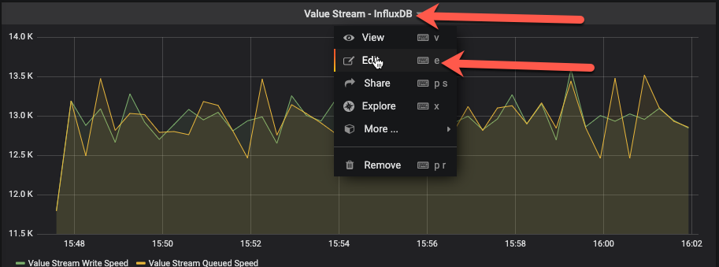

Add a new query with following configuration:

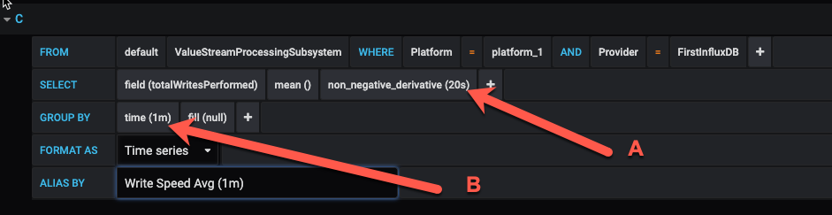

In above query, there are two additional figures: `20s` and `1m`, How do you choose?

`20s` should be as same as `sampling_cycle_inseconds` in your `tsample` configuration file. If you choose a different value, then you would end-up with a miss-leading results (It's not a difficult math problem though. :) )

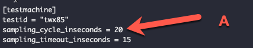

Larger values such as `1m` may give you a smoother result but could also hide system instability. `1m` should be a good choice for most case.

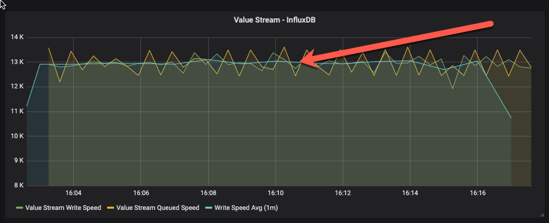

With this new query, it's much identical to figure out what's the average write speed in current testing. 

==Tips==: If your `sampling_cycle_inseconds` is `30s`, then you may not need this additional query. The following image is a sample at the 30s interval time. You would not need an additional average query to get a smooth write speed.

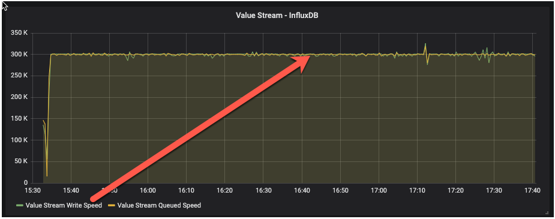

The next example is a sample at `10s` interval time. Without additional queries, you may not be able to get a meaningful understanding of the write speed.

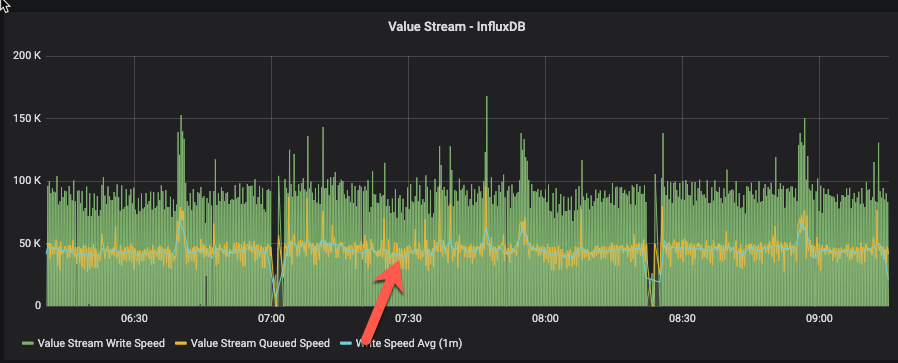

From above 3 example, It's recommended to configure the sampling interval time at `30s`, or anything larger than `20s`. You can then choose whether you need additional queries based on visualization result.

#### Step 11, Further refinement.

The above charts illustrate the queueing and writing speed. However, it is possible that the Value Stream may perform at a reasonable speed, but value stream queue may be growing and could exceed its capacity.

Let's add another query to monitor this:

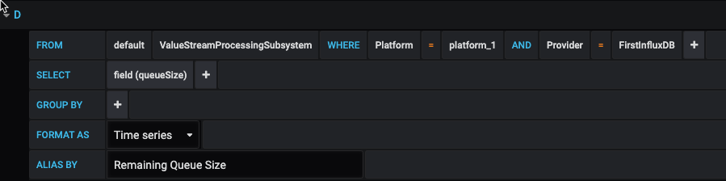

However, it's difficult to read this chart since it has a different value range on the y-axis:

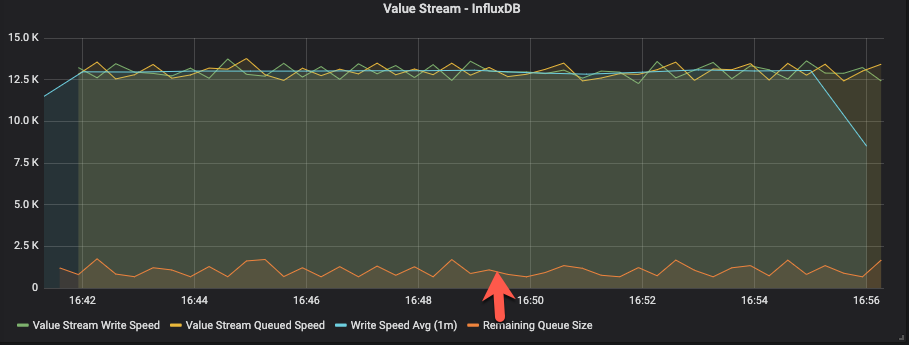

so, let's move this query to a second y-axis on the right:

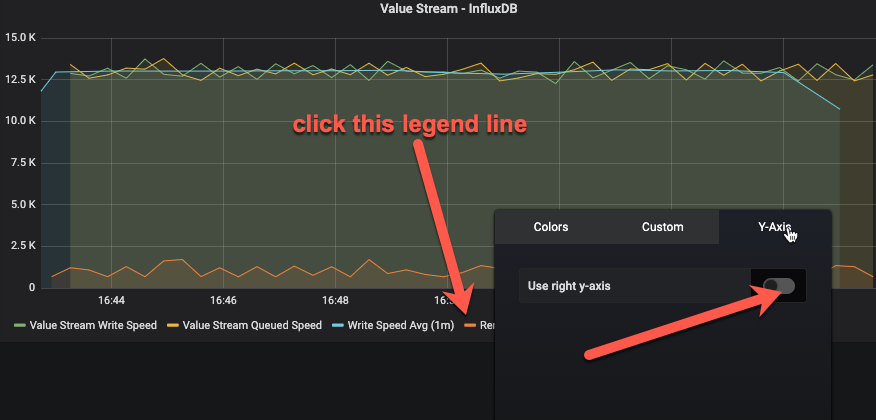

This will make the view much easier to see:


Current queue size or remaining queue size will always move up and down; it is healthy as long as it does not continue to grow to a high level.

### What else can be monitored.

Following metrics would be monitored very often:

- Value Stream Write speed
- Value stream queue speed
- Value stream queue size
- Stream write speed
- Stream queue speed
- Stream queue size
- Event performed speed (completedTaskCount)
- Event submited speed (submitedTaskCount )
- Event queue size
- Websocket communication
- Websocket connection

### Thingworx Memory Usage monitoring

Let's create a new panel and add a new query:

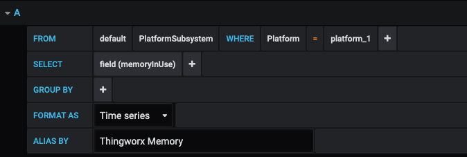

in a running system, memory usage will always move up and down - at times sharply (or quickly) -  when system is busy. The system is healthy as long as memory doesn't go up continuously or stay at maximum for a long period of time.

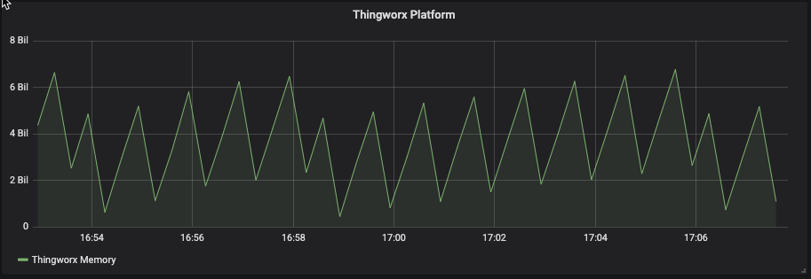


### There is more...

More monitoring tips will be added in future documentation release.

